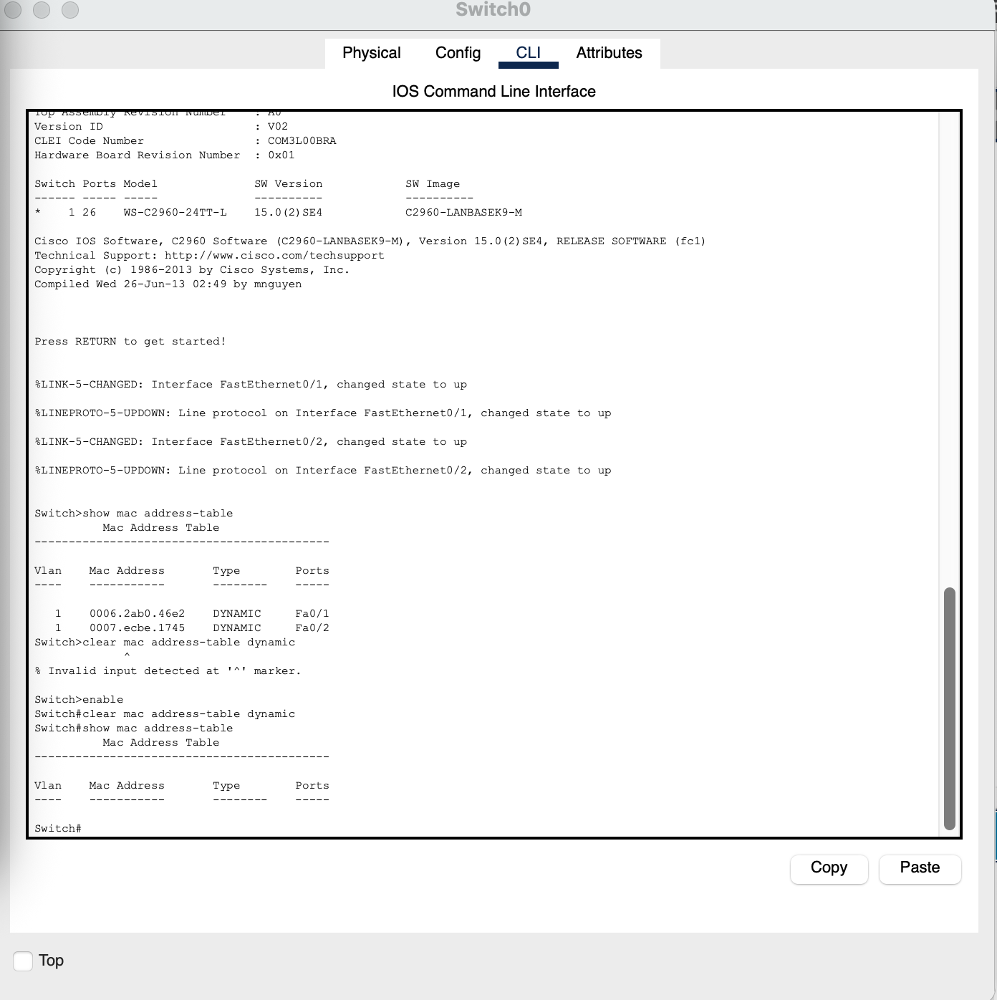

**HACKING THE WORKFORCE**

**Lab 1 --- Physical & Data Link Integrity**

*Week 1 · OSI Layers 1--2 · Worksheet & Submission*

+-------------+--------------+----------------------+----------------+
| **Name**    | **Date**     | **Environment used** | **Time spent** |
+=============+==============+======================+================+
| Omar Swoope | July 27 2026 | ACCESS sandbox /     | 3 hours        |
|             |              |                      |                |
|             |              | Linux VM / Packet    |                |
|             |              |                      |                |
|             |              | Tracer               |                |
+-------------+--------------+----------------------+----------------+

Part A --- Know Your Media (no terminal needed)
===============================================

*Complete the table using course materials or independent research.
Record maximum supported speed and maximum distance for each.*

  **Media**                 **Max Speed**                       **Max Distance**   **Typical Use Case**
  ------------------------- ----------------------------------- ------------------ ----------------------------------------------
  Cat 5e (twisted pair)     1 Gbps                              100 m              Modern LAN baseline
  Cat 6 (twisted pair)      1 Gbps (10 Gbps only up to \~55m)   100 m              High-performance LAN
  Cat 6a (twisted pair)     10 Gbps                             100 m              10GBASE-T; STP variant improves EMI immunity
  Multi-mode fiber (MMF)    400 Gbps                            550 m              Short distances inside buildings
  Single-mode fiber (SMF)   100 Gbps                            200 km             Long distances inside buildings

Scenario justifications
-----------------------

*For each scenario, choose the best-fit media and justify your choice in
one sentence.*

**Scenario 1**

A desk drop 40 meters from the wiring closet in a nonprofit\'s new
office, expected to serve VOIP + desktop for the next 10 years.

Cat 6a future-proofs throughput for the full 10-year horizon and
comfortably supports PoE for the VOIP phone

**Scenario 2**

A backbone link between two buildings on a hospital campus, 900 meters
apart.

Single mode fiber because it reaches up to 200km

**Scenario 3**

Server-to-switch links inside a single data center rack.

Multi mode fiber best for short to medium runs within data centers

Part B --- MAC Addresses & How Switches Learn (terminal)
========================================================

1--2. MAC address breakdown
---------------------------

*Run \`ip link show\` in your sandbox/VM. Record your primary
interface\'s MAC address, then split it into OUI (first 24 bits) and
device-specific portion (last 24 bits). Look up the OUI vendor.*

*Full MAC address:*

08:00:27:7d:f2:08

*OUI (first 3 byte-pairs) + vendor lookup result:*

08:00:27 PCS Systemtechnik GmbH (VirtualBox\'s default virtual NIC
vendor)

*Device-specific portion (last 3 byte-pairs):*

7d:f2:08

3. Locally administered bit
---------------------------

*Examine the second bit of the first byte of your MAC. Is it set? Why
might a locally administered MAC be a red flag during an incident
investigation?*

The bit is not set, so this is a real vendor assigned MAC, not a spoofed
one. If it had been set, that would mean the address was manually
changed by software instead of coming from the actual hardware, which is
how someone could fake a device's identity to get past MAC based access
controls or hide from monitoring. So during an investigation, a set bit
means you can't trust that MAC as proof of what device it really is.

4--5. Switch MAC table before/after ping
----------------------------------------

*Screenshot the switch\'s \`show mac address-table\` output BEFORE any
traffic is sent (should be empty). Paste screenshot below.*

*\[ Insert BEFORE screenshot here
\]*{width="7.0in"
height="7.020138888888889in"}

*Ping PC-B from PC-A, then run the command again. Paste the AFTER
screenshot below.*

*\[ Insert AFTER screenshot here \]* {width="7.0in"
height="7.1in"}

*Explain in your own words how the switch learned each entry, and what
it would have done with the very first frame when the table was empty.*

The switch learned entry by watching the source MAC address on every
frame that came through, it saw a device's MAC arrive on a specific port
and just noted this MAC lives here. If the table was empty when the very
first frame arrived, the switch wouldn't know where to send it, so it
would flood that frame out every port except the one it came in on,
until it learned where things actually were.

Part C --- Frame Health: CRC Errors, Runts, Giants (terminal)
=============================================================

1--2. Interface counter output
------------------------------

*Paste the output of \`ip -s link show eth0\` and \`ethtool -S eth0 \|
grep -iE \"crc\|runt\|giant\|jumbo\|frame\"\` below. Record RX
errors/dropped counts.*

\$ ip -s link show eth0

(paste output) 2: enp0s3: \<BROADCAST,MULTICAST,UP,LOWER\_UP\> mtu 1500
qdisc fq\_codel state UP mode DEFAULT group default qlen 1000

link/ether 08:00:27:7d:f2:08 brd ff:ff:ff:ff:ff:ff

RX: bytes packets errors dropped missed mcast

27126 61 0 0 0 1

TX: bytes packets errors dropped carrier collsns

7422 65 0 0 0 0

\$ ethtool -S eth0 \| grep -iE \"crc\|runt\|giant\|jumbo\|frame\"

(paste output)

rx\_crc\_errors: 0

rx\_frame\_errors: 0

3. Definitions
--------------

*Define each term and state its standard Ethernet size boundary.*

*Runt frame:*

An Ethernet frame smaller than 64 bytes (the minimum valid frame size)

*Giant frame:*

An Ethernet frame larger than 1518 bytes (the standard 1500-byte MTU
plus 18 bytes of Ethernet header and Frame Check Sequence).

*CRC error:*

A frame whose checksum (Frame Check Sequence) doesn't match what the
receiving device calculates from the bits actually received, indicating
the frame was corrupted in transit.

4. Investigation questions
--------------------------

*Name three possible causes of a steadily climbing CRC error counter.*

CRC errors happen when a frame gets corrupted in transit and no longer
matches its checksum. Common causes include: a damaged or poor quality
cable, electromagnetic interference (from things like fluorescent lights
or power cables running too close to network cabling), and a duplex
mismatch between a device and its switch port.

*CRC errors flat for six months suddenly spike on one office port, no
hardware changes on record. Why is this a security indicator, not just a
performance one? What would you check first?*

It's a security indicator because the fact there was a sudden spike
suggests that a port was changed or something plugged into it off the
records meaning it could be a possibility that someone connected a rogue
device. I would first go look to see what's plugged into that port.

*Why can a giant frame appear on a network where every device is
configured for a standard 1500-byte MTU?*

A device\'s MTU setting only limits what it intentionally sends, it
doesn\'t protect against corrupted frames, misconfigured hardware, or
extra bytes added elsewhere in the pipeline. The most common cause is
VLAN tagging when a switch adds an 802.1Q tag, it adds 4 extra bytes to
the frame, so a frame already at the full 1500-byte payload can end up
just over the standard 1518-byte limit, a technical giant, even though
every device\'s MTU is correctly set to 1500.

Part D --- GRC Bridge: Physical Layer Security Policy
=====================================================

1. Physical Layer Security policy statement
-------------------------------------------

*Draft a policy statement (3--5 sentences) for a small nonprofit office.
Must address: (a) minimum cabling standard for new installations, (b)
how unused switch ports are handled, (c) who is authorized to connect
devices to the wired network.*

Cat 6a will be the minimum cable standard for all new installations. All
unused ports will be administratively disabled by default and only
enabled when a device is formally assigned to that port. Only IT staff
are authorized to connect devices to the wired network or activate a
port: end users may not run their own cabling or connect unauthorized
equipment.

2. Cat 5e vs. Cat 6a recommendation
-----------------------------------

*Your client asks whether Cat 5e is \"good enough\" since it\'s cheaper
than Cat 6a. Write a 3--4 sentence recommendation addressing expected
throughput needs over a 10-year horizon and the cost of re-cabling vs.
over-provisioning.*

Cat 5e caps out around 1 Gbps at 100 meters struggling to support higher
speeds, compared to Cat 6a supporting 10 Gbps at the same distance. Cat
6a is slightly more expensive but avoids an expensive re cabling, and
tearing walls within a 10-year period. For that reason, I\'d recommend
Cat 6a now rather than saving a little today and paying much more to
upgrade later.

Submission Checklist
====================

*Confirm each item is complete before submitting Lab 1.*

-   Completed media table and scenario justifications (Part A)

-   MAC breakdown, OUI lookup, and locally-administered-bit answer
    (Part B)

-   Screenshot of the switch MAC table before and after the ping, with
    explanation (Part B)

-   Interface counter output and answers to all three investigation
    questions (Part C)

-   Physical Layer Security policy statement and Cat 5e vs. Cat 6a
    recommendation (Part D)
