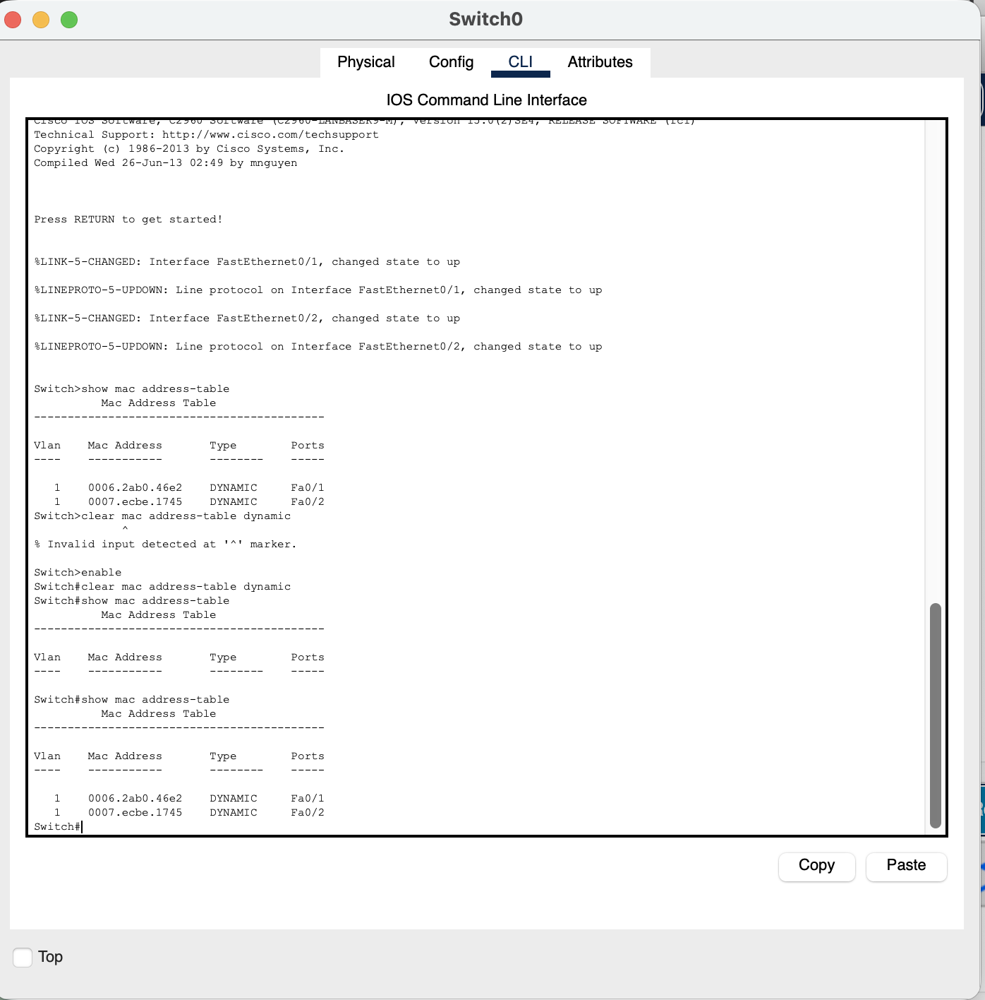

# Lab 1: Physical & Data Link Integrity
 
**OSI Layers 1–2** · Hacking the Workforce Network Security & GRC curriculum
 
| | |
|---|---|
| **Author** | Omar Swoope |
| **Date** | July 27, 2026 |
| **Environment** | ACCESS sandbox, Linux VM, Cisco Packet Tracer |
| **Time spent** | 3 hours |
 
## Objectives
 
- Compare network media and pick the right cabling for real scenarios
- Break down a MAC address and explain how a switch builds its MAC address table
- Read interface error counters (CRC errors, runts, giants) and treat them as security signals
- Write a physical-layer security policy for a small organization
---
 
## Part A: Network Media
 
| Media | Max speed | Max distance | Typical use |
|---|---|---|---|
| Cat 5e (twisted pair) | 1 Gbps | 100 m | Baseline modern LAN |
| Cat 6 (twisted pair) | 1 Gbps (10 Gbps up to ~55 m) | 100 m | High-performance LAN |
| Cat 6a (twisted pair) | 10 Gbps | 100 m | 10GBASE-T; shielded variant improves EMI immunity |
| Multi-mode fiber (MMF) | 10–100 Gbps | ~100–550 m (depends on speed and fiber grade) | Short runs inside buildings and data centers |
| Single-mode fiber (SMF) | 100 Gbps+ | 10 km+ (40–80 km with long-range optics) | Links between buildings, campuses and WANs |
 
### Scenario decisions
 
| Scenario | Choice | Reasoning |
|---|---|---|
| Desk drop 40 m from the wiring closet, VoIP + desktop, 10-year lifespan | **Cat 6a** | Future-proofs throughput for the full 10 years and comfortably supports PoE for the VoIP phone. |
| Backbone between two hospital buildings 900 m apart | **Single-mode fiber** | 900 m is beyond copper's 100 m limit and at the edge of multi-mode; single-mode handles it easily. |
| Server-to-switch links inside one data center rack | **Multi-mode fiber** | Built for short, high-speed runs and cheaper than single-mode at these distances. |
 
---
 
## Part B: MAC Addresses & Switch Learning
 
### MAC address breakdown
 
```
$ ip link show
link/ether 08:00:27:7d:f2:08
```
 
| Part | Value | Meaning |
|---|---|---|
| OUI (first 24 bits) | `08:00:27` | PCS Systemtechnik GmbH (VirtualBox's virtual NIC vendor) |
| Device-specific (last 24 bits) | `7d:f2:08` | Unique to this interface |
 
**Locally administered bit:** the second-least-significant bit of the first byte (`0x08` = `00001000`) is **not set**, so this is a vendor-assigned address, not one changed by software.
 
**Why it matters:** a set bit means the MAC was changed by software. Attackers do this to impersonate a trusted device, bypass MAC-based access controls or avoid monitoring. During an investigation, a locally administered MAC can't be trusted as proof of which physical device is on the network.
 
### Switch MAC table: before and after traffic
 
**Before** any traffic, the table is empty:
 

 
**After** pinging PC-B from PC-A:
 

 
**How the switch learned the entries:** it reads the *source* MAC of every frame it receives and records which port that MAC arrived on. When the very first frame arrived and the table was empty, the switch didn't know where the destination was, so it **flooded** the frame out every port except the one it came in on. It kept doing that until it learned where each device lived.
 
---
 
## Part C: Frame Health (CRC Errors, Runts, Giants)
 
### Interface counters
 
```
$ ip -s link show enp0s3
2: enp0s3: <BROADCAST,MULTICAST,UP,LOWER_UP> mtu 1500 qdisc fq_codel state UP mode DEFAULT group default qlen 1000
    link/ether 08:00:27:7d:f2:08 brd ff:ff:ff:ff:ff:ff
    RX:  bytes packets errors dropped  missed   mcast
         27126      61      0       0       0       1
    TX:  bytes packets errors dropped carrier collsns
          7422      65      0       0       0       0
 
$ ethtool -S enp0s3 | grep -iE "crc|runt|giant|jumbo|frame"
     rx_crc_errors: 0
     rx_frame_errors: 0
```
 
**Result:** 0 RX errors, 0 drops, 0 CRC errors and 0 frame errors. The link is healthy.
 
### Key terms
 
| Term | Definition |
|---|---|
| **Runt** | A frame smaller than 64 bytes, the minimum valid Ethernet frame size |
| **Giant** | A frame larger than 1518 bytes (1500-byte MTU + 18 bytes of header and FCS) |
| **CRC error** | A frame whose Frame Check Sequence doesn't match what the receiver calculates, meaning it was corrupted in transit |
 
### Analysis
 
**What causes a steadily climbing CRC error count?**
A damaged or low-quality cable, electromagnetic interference (for example, cabling run next to power lines or fluorescent lights), or a duplex mismatch between a device and its switch port.
 
**CRC errors were flat for six months, then suddenly spiked on one office port, with no hardware changes on record. Why is that a security concern?**
A sudden change on a single port with no documented work suggests something was plugged in or altered without authorization, such as a rogue device or a tap. **First step:** physically check what's connected to that port and compare it against the asset records.
 
**How can a giant frame appear when every device uses a 1500-byte MTU?**
MTU only limits what a device *sends*. The most common cause is **802.1Q VLAN tagging**: the switch adds a 4-byte tag, so a full-size frame grows to 1522 bytes, just over the 1518-byte limit. Corrupted frames and misconfigured hardware can also produce giants.
 
---
 
## Part D: GRC — Physical Layer Security Policy
 
### Policy statement (small nonprofit office)
 
> Cat 6a is the minimum cabling standard for all new installations. All unused switch ports are administratively disabled by default and enabled only when a device is formally assigned to that port. Only IT staff are authorized to connect devices to the wired network or activate a port; end users may not run their own cabling or connect unauthorized equipment.
 
### Recommendation: Cat 5e vs. Cat 6a
 
Cat 5e tops out at 1 Gbps over 100 m, while Cat 6a supports 10 Gbps over the same distance. Cat 6a costs slightly more up front, but it avoids an expensive re-cabling project, including opening walls, within the 10-year lifespan. **Recommendation: install Cat 6a now** rather than save a little today and pay much more to upgrade later.
 
---
 
## Skills demonstrated
 
`ip` · `ethtool` · Cisco Packet Tracer · MAC/OUI analysis · switch MAC learning · interface error analysis · physical security policy writing
 

