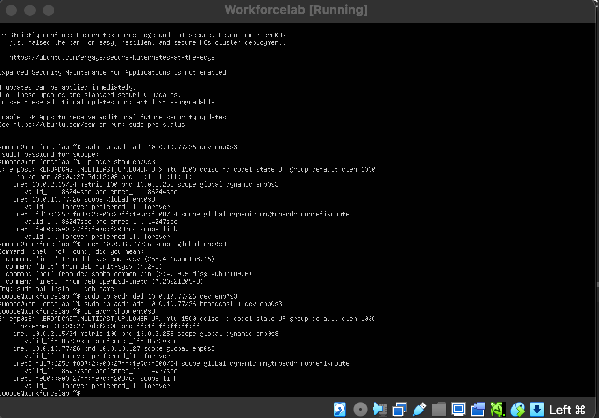

# Lab 2: Logical Boundaries & IP Addressing
 
**OSI Layer 3** · Hacking the Workforce Network Security & GRC curriculum
 
| | |
|---|---|
| **Author** | Omar Swoope |
| **Date** | July 29, 2026 |
| **Environment** | ACCESS sandbox, Linux VM, Cisco Packet Tracer |
| **Time spent** | 3 hours |
 
## Objectives
 
- Convert between decimal, binary and hex by hand
- Classify unicast, multicast and broadcast traffic, and capture it live
- Calculate network, broadcast and usable host ranges for any subnet
- Investigate a real-world **duplicate IP conflict** using ARP evidence
- Write a network isolation policy for an organization handling health records
---
 
## Part A: Number Systems
 
### Decimal → binary
 
| Decimal | Binary | Work |
|---|---|---|
| 192 | `11000000` | 128 + 64 |
| 168 | `10101000` | 128 + 32 + 8 |
| 10 | `00001010` | 8 + 2 |
| 172 | `10101100` | 128 + 32 + 8 + 4 |
| 255 | `11111111` | 128 + 64 + 32 + 16 + 8 + 4 + 2 + 1 |
 
### Binary → decimal
 
| Binary | Decimal |
|---|---|
| `11000000` | 192 |
| `10101100` | 172 |
| `11100000` | 224 |
| `01111111` | 127 |
 
### Hex (first two bytes of my Lab 1 MAC)
 
```
08 → 0000 1000 → 08
00 → 0000 0000 → 00
```
 
**Why hex for MACs but dotted decimal for IPv4?** A MAC address breaks cleanly into 12 hex digits (4 bits each), which makes it compact and easy to convert by hand. IPv4 addresses are used constantly for arithmetic (subnetting, ranges, network and broadcast addresses), and dotted decimal is much easier for that kind of math.
 
---
 
## Part B: Unicast, Multicast & Broadcast
 
### Address classification (assuming 192.168.1.0/24)
 
| Address | Type | Who receives it |
|---|---|---|
| `192.168.1.45` | Unicast | Only the one device with that address |
| `224.0.0.251` | Multicast | Only devices subscribed to that group |
| `192.168.1.255` | Directed broadcast | Every device on 192.168.1.0/24 |
| `255.255.255.255` | Limited broadcast | Every device on the local segment |
| `ff:ff:ff:ff:ff:ff` | Layer 2 broadcast | Every device on the local segment |
 
### Live capture
 
```
$ sudo tcpdump -i enp0s3 -c 10 'broadcast or multicast'
15:05:58.576774 IP6 _gateway > ip6-allnodes: ICMP6, router advertisement, length 80
15:05:58.580504 IP6 workforcelab > ff02::16: HBH ICMP6, multicast listener report v2, 1 group record(s), length 28
15:05:59.812925 IP6 workforcelab > ff02::16: HBH ICMP6, multicast listener report v2, 1 group record(s), length 28
```
 
**What a passive listener learns without sending a single packet:**
 
- **ICMPv6 router advertisements:** the router announces itself and the network to every IPv6 device, revealing who the gateway is.
- **MLDv2 listener reports:** my VM announced which multicast groups it wants to receive, revealing that the device exists and what it's listening for.
---
 
## Part C: Network & Broadcast Addresses
 
| IP / mask | Network | Broadcast | Usable range |
|---|---|---|---|
| 172.16.54.29 /24 | 172.16.54.0 | 172.16.54.255 | .1 – .254 |
| 10.0.10.77 /26 | 10.0.10.64 | 10.0.10.127 | .65 – .126 |
| 192.168.1.200 /27 | 192.168.1.192 | 192.168.1.223 | .193 – .222 |
| 10.0.10.130 /25 | 10.0.10.128 | 10.0.10.255 | .129 – .254 |
 
### Why a mask change breaks connectivity
 
Host A (`10.0.10.128`) and Host B (`10.0.10.64`) talk normally with a `/24` mask. After changing both to `/25` (`255.255.255.128`), the `/24` splits into two subnets:
 
- `10.0.10.0/25` (.0 – .127) contains **Host B**
- `10.0.10.128/25` (.128 – .255) contains **Host A**
They're now on **different subnets**, so they can't reach each other directly. A **router** (or Layer 3 switch) is required between them. (`10.0.10.128` is also the network address of its new subnet, so it would need a new IP anyway.)
 
### Verification on my VM
 
I added `10.0.10.77/26` to my VM, and `ip addr show` reported broadcast `10.0.10.127`, matching my hand calculation.
 

 
---
 
## Part D: Incident Investigation — Duplicate IP Conflict
 
> **Ticket:** A case manager's workstation (`192.168.1.50`) keeps dropping off the network every few minutes, then comes back. Yesterday a volunteer set up a donated printer. Nothing else changed.
 
### 1. Initial hypothesis
 
The timing points to the new printer. My first thought was that it was interfering with the workstation's connection. The ARP evidence below narrowed that down to a specific cause.
 
### 2. ARP evidence
 
```
$ ip neigh show | grep 192.168.1.50
192.168.1.50 dev eth0 lladdr a4:5e:60:b2:11:09 REACHABLE
 
$ ping -c 2 192.168.1.50 && ip neigh show | grep 192.168.1.50
192.168.1.50 dev eth0 lladdr 00:1b:a9:c3:77:d2 REACHABLE
```
 
**The same IP resolved to two different MAC addresses.** Two devices are using the same IP, and the network sends traffic to whichever one answered the most recent ARP request. That's why the workstation's connection keeps flipping on and off.
 
### 3. Confirmation
 
```
$ sudo arping -D -c 4 -I enp0s3 192.168.1.50
Unicast reply from 192.168.1.50 [a4:5e:60:b2:11:09]
Unicast reply from 192.168.1.50 [00:1b:a9:c3:77:d2]
... 2 replies — DUPLICATE ADDRESS DETECTED
```
 
### 4. Root cause & remediation
 
| | |
|---|---|
| **Printer's MAC** | `00:1b:a9:c3:77:d2` (identified by OUI lookup, the Lab 1 skill) |
| **Root cause** | The volunteer gave the printer a static IP that was already assigned to the workstation |
| **Immediate fix** | Move the printer to an unused IP |
| **Prevent recurrence** | Assign addresses through DHCP (with a reservation for the printer), managed by IT |
 
### 5. Controls that would have prevented this
 
- Only IT personnel may connect devices to the network.
- IT maintains a documented inventory of assigned IP addresses, so an address already in use is never handed out.
---
 
## Part E: GRC — Network Isolation Policy
 
### Policy statement (nonprofit handling client health records)
 
> Guest Wi-Fi and staff/client-records systems must be on separate networks so a guest device can never observe or reach systems holding client data. Staff workstations are placed on a dedicated VLAN, isolated from the guest network's broadcast domain. IP addresses are assigned automatically by DHCP, managed only by IT staff. Any request to change IP configuration or allow an exception must go through IT and be documented.
 
### Explaining it to an executive director
 
Imagine walking into a room full of strangers and announcing you have confidential information: now everyone knows you're there and can listen for anything useful. That's what happens on a shared network. Devices constantly announce information about themselves, as my capture in Part B showed, and anyone on the same network can hear it. Keeping guest Wi-Fi on a separate network means visitors are never in the same "room" as the systems holding client data.
 
---
 
## Skills demonstrated
 
Binary/hex conversion · subnet math · `tcpdump` · `ip` · `arping` · ARP analysis · incident investigation and root-cause analysis · network isolation policy
 
