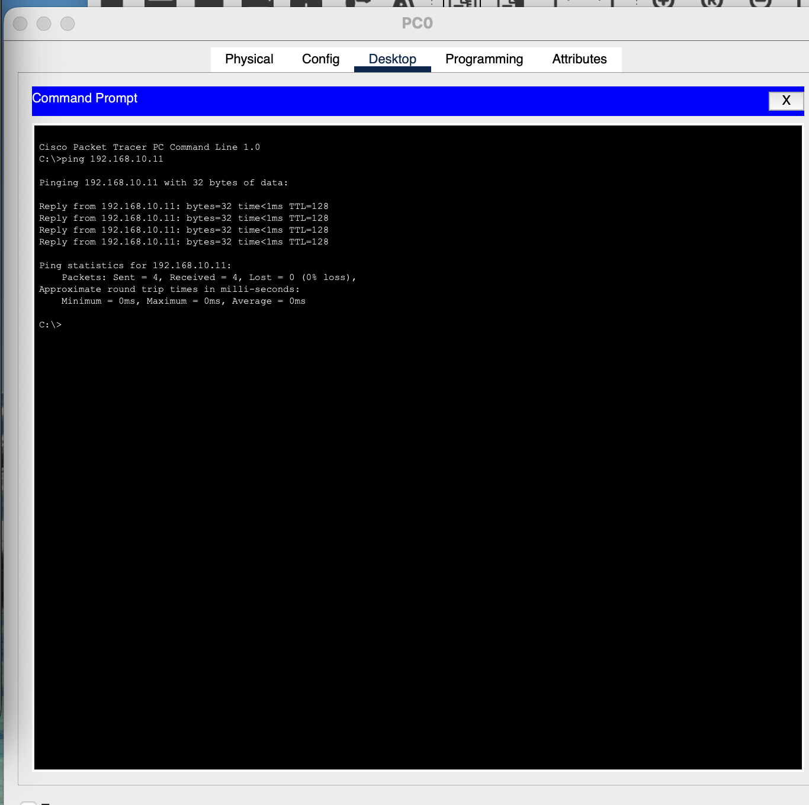
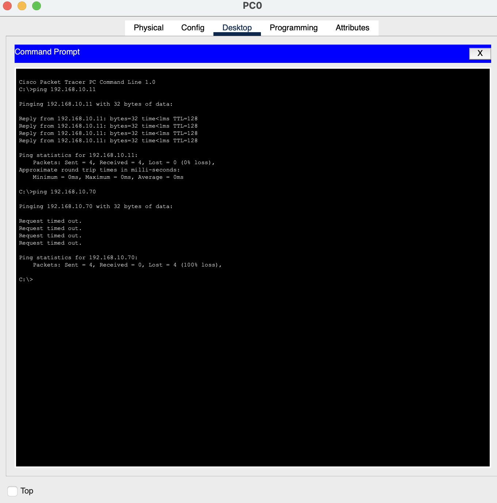

# Lab 3: The Subnetting Puzzle & Access Control
 
**OSI Layer 3 (VLSM)** · Hacking the Workforce Network Security & GRC curriculum
 
| | |
|---|---|
| **Author** | Omar Swoope |
| **Date** | August 10, 2026 |
| **Environment** | Cisco Packet Tracer |
| **Time spent** | 2.5 hours |
 
> Self-directed edition: I built this lab from the program's Week 3 preview, since the full instructions weren't available outside the cohort platform.
 
## Scenario
 
A small business needs to split one address block, **192.168.10.0/24**, into four subnets of different sizes (Production/Staff, VoIP phones, Guest Wi-Fi and Management), with strict access control between them.
 
My tasks: size each subnet with VLSM, carve up the /24 without overlap, build and test it in Packet Tracer, decide which subnets may talk to each other, and write the policy for future subnet requests.
 
---
 
## Part A: Sizing the Subnets (VLSM)
 
Each subnet needs enough host bits (h) to cover its devices, where **2^h − 2 ≥ hosts needed** (2 addresses are reserved for the network and broadcast). Using the smallest h that fits avoids wasting addresses.
 
| Department | Hosts needed | Host bits | CIDR | Block size |
|---|---|---|---|---|
| Production / Staff | 60 | 6 | /26 | 64 |
| VoIP phones | 25 | 5 | /27 | 32 |
| Guest Wi-Fi | 12 | 4 | /28 | 16 |
| Management (switches/APs) | 6 | 3 | /29 | 8 |
 
---
 
## Part B: VLSM Allocation
 
Subnets are allocated **largest to smallest**, each starting right after the previous one ends, to avoid fragmentation.
 
| Department | CIDR | Network | Broadcast | Usable range |
|---|---|---|---|---|
| Production / Staff | /26 | 192.168.10.0 | 192.168.10.63 | .1 – .62 |
| VoIP phones | /27 | 192.168.10.64 | 192.168.10.95 | .65 – .94 |
| Guest Wi-Fi | /28 | 192.168.10.96 | 192.168.10.111 | .97 – .110 |
| Management | /29 | 192.168.10.112 | 192.168.10.119 | .113 – .118 |
 
**Block-boundary math:**
 
```
Production:  0   + 64 − 1 = 63    →  .0   – .63
VoIP:        64  + 32 − 1 = 95    →  .64  – .95
Guest:       96  + 16 − 1 = 111   →  .96  – .111
Management:  112 + 8  − 1 = 119   →  .112 – .119
```
 
Addresses `.120 – .255` remain free for future growth.
 
---
 
## Part C: Build & Verify in Packet Tracer
 
I built the four VLANs in Packet Tracer and placed a PC in each one, using an address from its allocated range.
 
**Same VLAN: ping succeeds**
 

 
**Different VLANs, no inter-VLAN routing: ping fails (100% loss)**
 

 
This confirms the VLANs are isolated. Traffic can't cross between subnets unless a router is configured to allow it.
 
---
 
## Part D: Access Control Matrix
 
Traffic from the **row** (source) to the **column** (destination):
 
| Source ↓ / Destination → | Production | VoIP | Guest | Management |
|---|---|---|---|---|
| **Production** | Allow | Deny | Deny | Deny |
| **VoIP** | Allow | Allow | Deny | Deny |
| **Guest** | Deny | Deny | Allow | Deny |
| **Management** | Allow | Allow | Allow | Allow |
 
**Reasoning:**
 
- **Guest is denied everywhere** (network segmentation): guests have no business reason to reach internal systems. Allowing it would create an attack path from an untrusted, possibly compromised device into internal traffic.
- **Management is reachable only from itself** (least privilege): switches and access points are high-value targets, so only authorized admins should reach them.
- **Management can reach every subnet:** administrators need that access to do their job. Every other subnet gets only the access its role requires.
---
 
## Part E: GRC — Subnet Allocation Policy
 
### Policy statement
 
> New subnets are sized to the actual number of hosts required and requested through the network administrator. All subnet assignments are documented in the internal network topology map. Subnets are denied from communicating with each other by default; traffic between them is allowed only when explicitly approved. Least privilege applies, so each subnet receives only the access it needs. The network administrator has sole authority to approve exceptions.
 
### Explaining it to a business owner
 
Think of your network as a house party. Guests are welcome in the living room (guest Wi-Fi) but not in the bedrooms (your internal networks). On a shared network, every device can technically see traffic passing by, so a guest's laptop could pick up business data the same way someone in the living room might overhear a private conversation a few rooms away. A separate subnet keeps guests out of the bedrooms entirely.
 
---
 
## Skills demonstrated
 
VLSM subnet design · VLAN segmentation · Cisco Packet Tracer · access control matrix · least privilege and default-deny · subnet allocation policy
 

