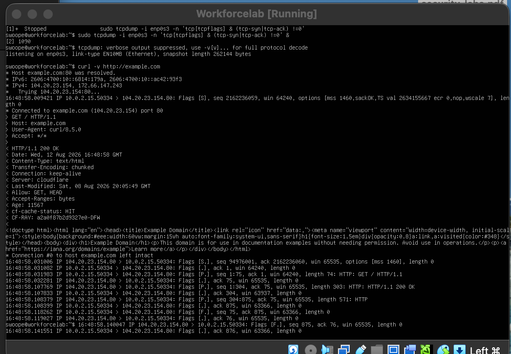
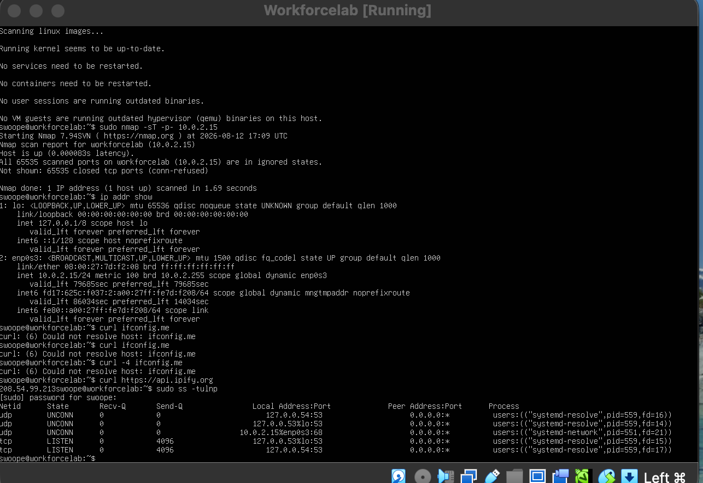
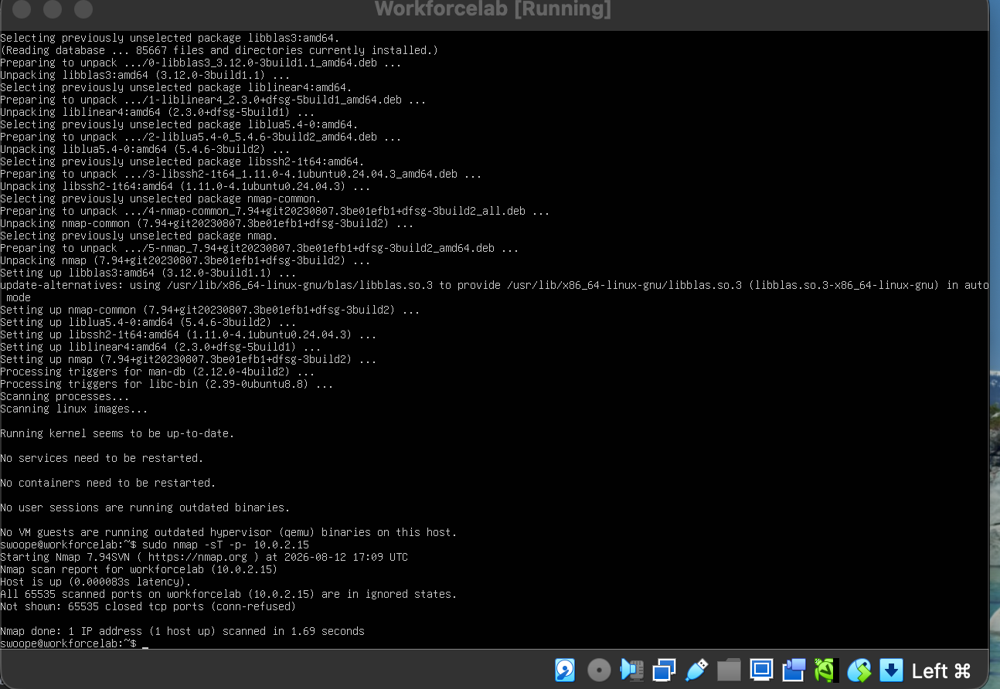
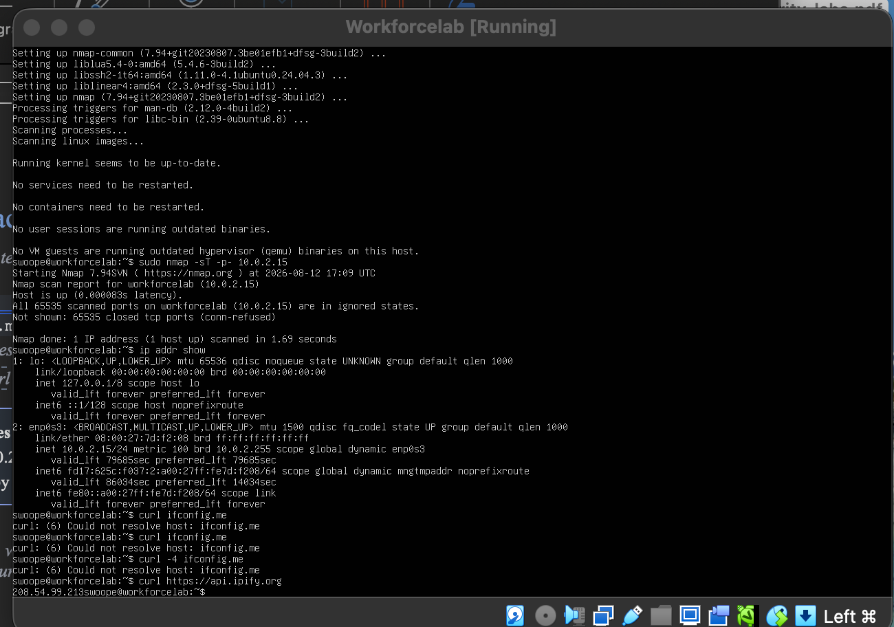

Lab4 readme · MD
# Lab 4: The Handshake & Availability
 
**OSI Layer 4 (TCP)** · Hacking the Workforce Network Security & GRC curriculum
 
| | |
|---|---|
| **Author** | Omar Swoope |
| **Date** | August 12, 2026 |
| **Environment** | Ubuntu Server VM (VirtualBox) |
| **Time spent** | 3 hours |
 
> Self-directed edition: I built this lab from the program's Week 4 preview, since the full instructions weren't available outside the cohort platform.
 
## Scenario
 
A small business wants to confirm two things: that connections to its servers are establishing properly, and that no unauthorized **"shadow IT"** services are quietly listening on its machines.
 
My tasks: capture a real TCP handshake, audit my VM's open ports from the inside and the outside, trace how private traffic reaches the internet through NAT, and write a service hardening standard.
 
---
 
## Part A: The TCP Three-Way Handshake
 
| Step | Sender | Flags | Purpose |
|---|---|---|---|
| 1 | Client | `SYN` | Asks to open a connection |
| 2 | Server | `SYN-ACK` | Acknowledges the request and agrees to connect |
| 3 | Client | `ACK` | Confirms the server's reply; the connection is now established |
 
All three steps have to happen before either side sends data. It's like a conversation: both sides need to confirm they can hear each other before it starts.
 
### Live capture
 
```
$ sudo tcpdump -i enp0s3 -n 'tcp[tcpflags] & (tcp-syn|tcp-ack) != 0' &
$ curl -v http://example.com
```
 
The capture shows the `[S]`, `[S.]` and `[.]` packets (SYN, SYN-ACK, ACK) between my VM (`10.0.2.15`) and example.com, followed by the HTTP request and response.
 

 
**What if the final ACK never arrived (for example, dropped by a firewall)?** The capture would show the SYN and SYN-ACK, but no ACK. The connection would never fully open: the server would wait in a half-open state, then time out and drop the attempt.
 
---
 
## Part B: Shadow IT Hunt (`ss` + `nmap`)
 
Every open port is a door into the machine. An auditor's job is to find every door and confirm it's supposed to be open.
 
### Inside view: `ss`
 
```
$ sudo ss -tulnp
```
 
### Outside view: `nmap`
 
```
$ nmap -sT -p- 10.0.2.15
All 65535 scanned ports on workforcelab (10.0.2.15) are in ignored states.
Not shown: 65535 closed tcp ports (conn-refused)
```
 

 

 
### Reconciled service inventory
 
| Port | Protocol | Service | Listening on | Expected? | Action |
|---|---|---|---|---|---|
| 53 | UDP / TCP | `systemd-resolved` (local DNS resolver) | Loopback only (127.0.0.53, 127.0.0.54) | Yes | Leave it; not reachable from the network |
| 68 | UDP | `systemd-networkd` (DHCP client) | enp0s3 | Yes | Leave it; needed to get an IP address |
 
**Result:** no unexpected services. `nmap` found **all 65,535 TCP ports closed** to the network.
 
### Why check from both sides?
 
Each view covers the other's blind spots:
 
- **`ss` (inside)** sees everything listening, including loopback-only and UDP services. `nmap -sT` only tests TCP, and it can't reach loopback addresses from the network.
- **`nmap` (outside)** shows what an attacker could actually reach. If malware hid itself from local tools like `ss`, an outside scan could still expose its open port.
---
 
## Part C: Tracing NAT
 
```
$ ip addr show     →  10.0.2.15/24 (private)
$ curl https://api.ipify.org   →  208.54.x.x (public, redacted)
```
 

 
**Why are they different?** My VM's private IP isn't routable on the internet. As traffic leaves the network, **NAT** replaces the private source address with the router's public IP. It also rewrites the **source port**, and it uses that port number to remember which internal device each reply belongs to when many devices share one public IP.
 
A device on the internet can't send traffic straight to `10.0.2.15`, because private addresses aren't routed on the public internet, and NAT only creates mappings for connections that start *inside* the network.
 
---
 
## Part D: GRC — Service Hardening Standard
 
### Policy statement
 
> New or unknown services are denied by default and may run only after approval by the network administrator. Each request is evaluated for its business need and its security impact before approval. Open ports are audited daily from both the host (`ss`) and the network (`nmap`). Any unapproved service found is disabled immediately and stays disabled until it is formally reviewed.
 
### Explaining it to a business owner
 
Think of ports as entrances to an office building. An open port nobody remembers enabling is an unlocked side door: unauthorized people can walk in and blend in with the people who belong there. The network admin is the security guard, and `ss` and `nmap` are how they check every door. My audit found every door locked except the ones the system needs.
 
---
 
## Skills demonstrated
 
TCP handshake analysis · `tcpdump` · `ss` · `nmap` · service inventory and auditing · NAT · service hardening policy
 

