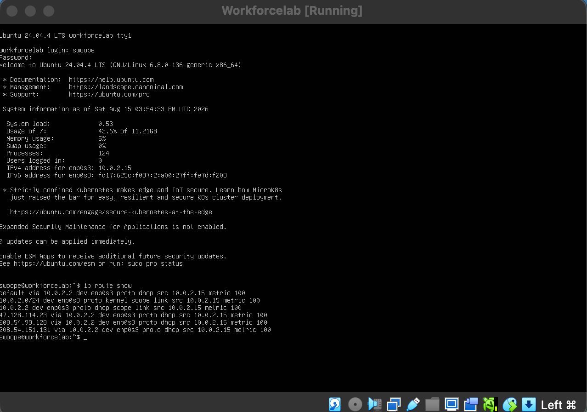
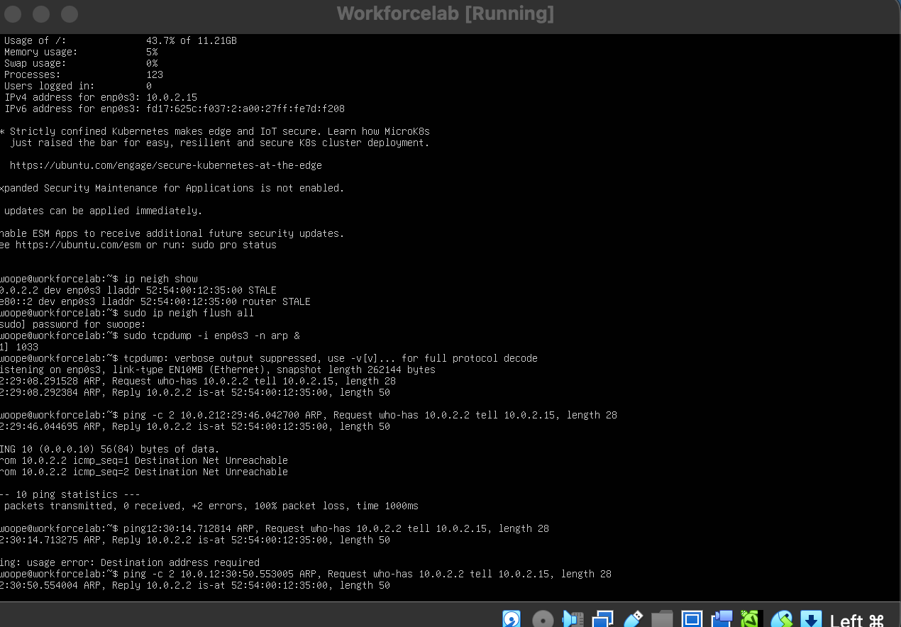
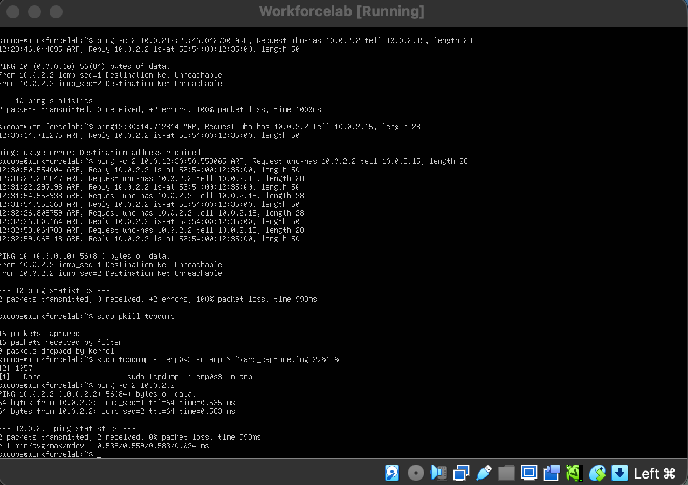
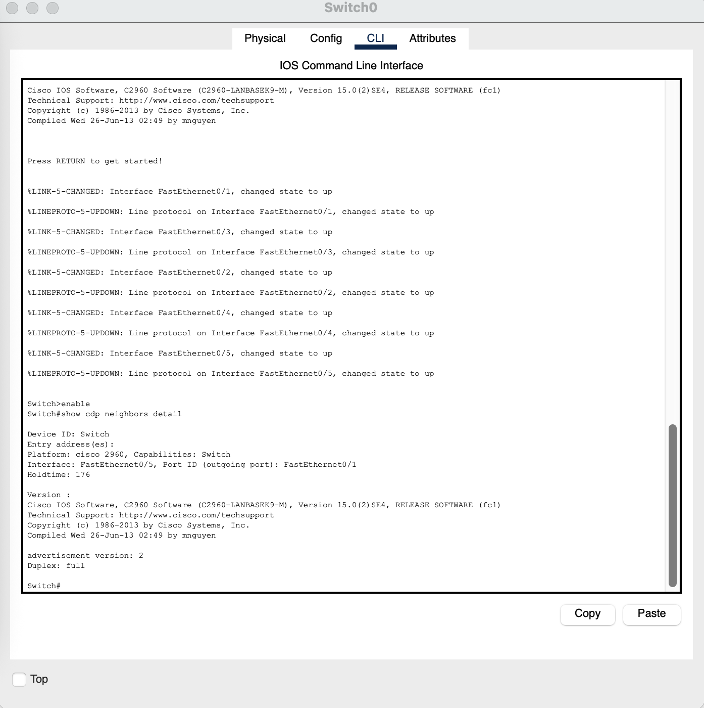

# Lab 5: Discovery, Routing & Compliance (Capstone)
 
**Routing · ARP · Neighbor Discovery** · Hacking the Workforce Network Security & GRC curriculum
 
| | |
|---|---|
| **Author** | Omar Swoope |
| **Date** | August 15, 2026 |
| **Environment** | Ubuntu Server VM (VirtualBox), Cisco Packet Tracer |
| **Time spent** | 3 hours |
 
> Self-directed edition: I built this lab from the program's Week 5 preview, since the full instructions weren't available outside the cohort platform.
 
## Scenario
 
This capstone asks for a full network audit: confirm devices can be identified and trusted, then document how incidents will be detected and handled.
 
My tasks: read my VM's routing table, watch ARP resolve IPs to MAC addresses, see what a switch reveals through neighbor discovery, then combine the findings from Labs 1–4 into an audit report and an incident response policy.
 
---
 
## Part A: Reading the Routing Table
 
A **default gateway** is the router that connects a local network to other networks and the internet. A device needs a **routing table** to decide, for every outgoing packet, whether the destination is on its own subnet (deliver directly) or somewhere else (send it to the gateway).
 
```
$ ip route show
```
 

 
| Destination | Gateway | Interface | Purpose |
|---|---|---|---|
| `default` | 10.0.2.2 | enp0s3 | Reach anything outside my subnet |
| `10.0.2.0/24` | None (directly connected) | enp0s3 | Reach devices on my own subnet |
 
**Without the default route:** the VM could still reach devices on `10.0.2.0/24`, because that route says they're directly connected. It could **not** reach example.com, because nothing would tell it where to send traffic for outside networks. That's exactly the job of the default gateway.
 
---
 
## Part B: ARP — Mapping IP to MAC
 
| Step | Sender | Message type | Purpose |
|---|---|---|---|
| 1 | My VM | Broadcast | "Who has this IP?", asked to every device on the subnet |
| 2 | Target device | Unicast | "I do. Here's my MAC address." |
 
**Why must the request be a broadcast?** The VM knows the target's IP but not its MAC, and Ethernet can only deliver frames to a MAC address. With no way to address that one device yet, the question has to go to everyone.
 
### Live capture
 
```
$ sudo ip neigh flush all
$ sudo tcpdump -i enp0s3 -n arp &
$ ping -c 2 10.0.2.2
 
ARP, Request who-has 10.0.2.2 tell 10.0.2.15, length 28
ARP, Reply 10.0.2.2 is-at 52:54:00:12:35:00, length 50
```
 

 

 
### Security angle: ARP spoofing
 
ARP has **no authentication**; any device can claim to own any IP. An attacker can send forged ARP replies that tie *their* MAC address to another device's IP (for example, the gateway). Both victims then unknowingly send their traffic through the attacker, a **man-in-the-middle** attack.
 
This connects to the **duplicate-IP incident in Lab 2**: in both cases a device claims an identity that isn't really its own, and the network believes it because ARP can't verify the claim.
 
---
 
## Part C: Neighbor Discovery (CDP / LLDP)
 
```
Switch# show cdp neighbors detail
```
 

 
**What CDP revealed about the neighbor, with no authentication:**
 
- **Device ID and platform:** `Switch`, a Cisco 2960
- **Interfaces:** connected from local port `Fa0/5` to its `Fa0/1`
- It also showed the full IOS software version, which tells an attacker exactly which vulnerabilities to look up
**Should CDP/LLDP run on every port?** No, only on trusted switch-to-switch uplinks. Anyone who plugs a laptop into an unused wall port would receive the same information. Following **least privilege**, a port with no legitimate network device attached has no reason to broadcast it, and unused ports should be disabled (as in my Lab 1 policy).
 
---
 
## Part D: Final Network Audit Report
 
| Category | Finding | Risk | Ref |
|---|---|---|---|
| Physical / cabling | Interface counters clean (0 CRC or frame errors); Cat 6a set as the cabling standard | Low | Lab 1 |
| IP addressing | Static IP assigned by a volunteer caused a duplicate IP conflict | Moderate (resolved) | Lab 2 |
| Subnetting | VLSM plan allocated largest to smallest with no overlap and room to grow | Low | Lab 3 |
| Segmentation & access control | Guest denied to all internal subnets; only Management has broad access | Low | Lab 3 |
| Exposed services | No unexpected open ports (`ss` and `nmap` both clean) | Low | Lab 4 |
| NAT / external exposure | Private IP is non-routable; no externally reachable services | Low | Lab 4 |
| Neighbor discovery | CDP broadcasts device model, ports and software version with no authentication | **Moderate** | Lab 5 |
| ARP | ARP has no authentication, so spoofing is possible on any shared segment | **Moderate** | Lab 5 |
 
### Top 3 recommendations
 
1. **Lock down unused ports:** disable them, enable port security to restrict MAC addresses, and turn off CDP/LLDP on everything except switch-to-switch uplinks.
2. **Keep guest traffic isolated** from the internal LAN to prevent unauthorized traffic monitoring.
3. **Audit on a schedule:** run `ss` and `nmap` daily to catch unauthorized services early, and use DHCP with a documented IP inventory to prevent address conflicts.
---
 
## Part E: GRC — Incident Response & Visibility Policy
 
### Policy statement
 
> The network is checked on a regular schedule: `ss` and `nmap` for open ports, ARP tables for forged or conflicting entries, and CDP for information leaking from unused ports. Anyone who finds something unexpected (a rogue device, a duplicate IP or an unexpected open port) reports it directly to the network administrator. Only the network administrator has the authority to isolate or disconnect a suspect device. After resolution, the network administrator documents the root cause, the actions taken and the outcome for future reference.
 
### Explaining it to a business owner
 
Imagine you own 50 storage units rented to paying customers. The units are your ports, and the customers are your devices. Without routine walk-throughs, you'd never know someone had moved into an empty unit without paying until real damage was done. `ss` and `nmap` are those walk-throughs. **You can't respond to a threat you don't know exists**, which is why visibility comes first.
 
---
 
## Skills demonstrated
 
Routing table analysis · ARP and ARP-spoofing risk · `tcpdump` · CDP/LLDP exposure · network audit reporting · risk rating · incident response policy
 
